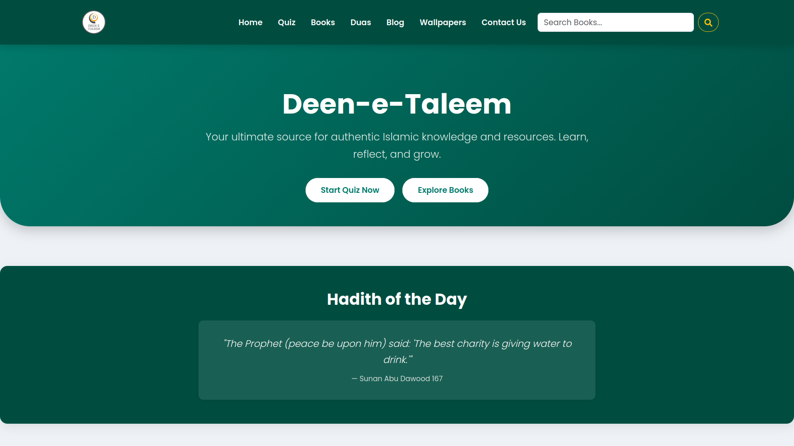
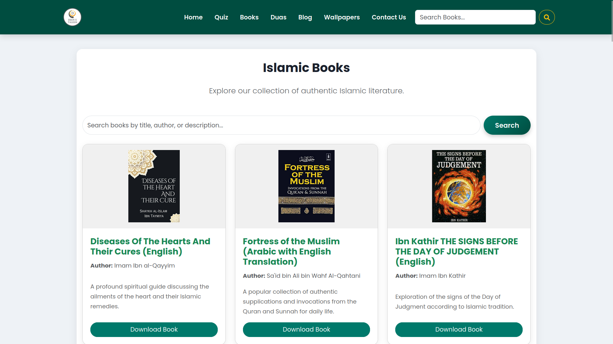
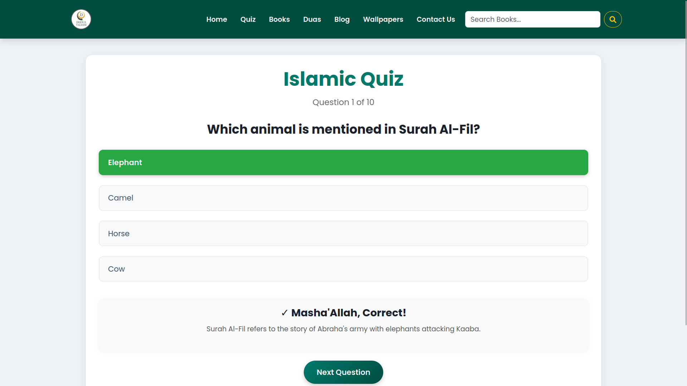
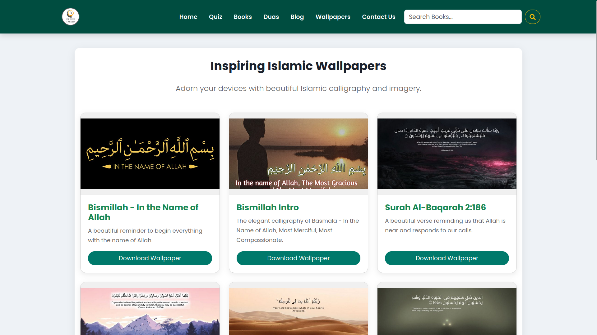

<div align="center">

# 📘 Deen-e-Taleem

**An elegant and accessible Islamic educational platform built with Flask.**

[](https://www.python.org/)
[](https://flask.palletsprojects.com/)
[](https://deen-e-taleem.onrender.com)
[](https://deen-e-taleem.onrender.com)

<p>
  <a href="#-about-the-project">About</a> •
  <a href="#-screenshots">Screenshots</a> •
  <a href="#-features">Features</a> •
  <a href="#-getting-started">Getting Started</a> •
  <a href="#-Deployment-(Render)">Deployment</a>
</p>
</div>

---

## 📖 About The Project

**Deen-e-Taleem** is an Islamic educational web application designed to spread authentic knowledge in a beautiful, structured, and user-friendly way. It offers a centralized hub for Islamic literature, interactive learning via quizzes, daily duas, Hadiths, and high-quality wallpapers.

**🌐 Live Website:** [Deen-e-Taleem (Render)](https://deen-e-taleem.onrender.com)

---

## 📸 Screenshots

|                            Home Page                           |                            Books Directory                           |
| :------------------------------------------------------------: | :------------------------------------------------------------------: |
|  |       |
|                        **Quiz Feature**                        |                        **Islamic Wallpapers**                        |
|  |  |

---

## 📚 Features

* **📘 Downloadable Library:** Access and download curated Islamic books (integrated with Google Drive).
* **💬 Blogs & Articles:** Read beautifully formatted Islamic blogs and insights.
* **🖼️ Wallpaper Gallery:** Browse and download high-quality Islamic wallpapers.
* **❓ Interactive Quizzes:** Test your Islamic knowledge with a built-in quiz feature.
* **🤲 Daily Duas & Hadith:** Dedicated sections for authentic supplications and traditions.
* **🔎 Responsive Design:** A simple, clean, and mobile-friendly user interface.

---

## 🛠️ Tech Stack

* **Backend:** Python, Flask
* **Frontend:** HTML5, CSS3, Vanilla JavaScript
* **Database/Storage:** JSON (Local Data Storage), Google Drive (File Hosting)
* **Deployment:** Render, Gunicorn
* **Version Control:** Git, GitHub

---

## 🚀 Getting Started

To get a local copy up and running, follow these simple steps.

### Prerequisites

Make sure you have Python 3.x installed on your system.

### Installation

1. **Clone the repository**

```bash
git clone https://github.com/mfhaque0/Deen-e-Taleem.git
```

2. Navigate to the project directory

```bash
cd Deen-e-Taleem
```

3. Create a virtual environment (Recommended)

```bash
python -m venv venv
```

4. Activate the virtual environment

Windows:

```bash
venv\Scripts\activate
```

Mac/Linux:

```bash
source venv/bin/activate
```

5. Install dependencies

```bash
pip install -r requirements.txt
```

6. Run the application

```bash
flask run
```

or

```bash
python app.py
```

7. Open your browser and visit:

```text
http://127.0.0.1:5000
```

---

## 📁 Project Structure

```bash
Deen-e-Taleem/
│
├── app.py                   # Main Flask application
├── requirements.txt         # Python dependencies
├── Procfile                 # Deployment configuration for Gunicorn
├── README.md                # Project documentation
│
├── data/                    # JSON data files (Books, Blogs, Duas, Quizzes, etc.)
├── static/                  # Static assets (CSS, JS, Images, Thumbnails)
├── templates/               # HTML templates (Jinja2)
├── downloadable_files/      # Hosted files for direct download
├── blog_posts/              # Markdown or text files for blog content
```

---

## 🌍 Deployment-(Render)

Deploying this app to Render is straightforward:

* Push your project to GitHub
* Log in to Render and click **New Web Service**
* Connect your GitHub repository

Configure:

**Build Command**

```bash
pip install -r requirements.txt
```

**Start Command**

```bash
gunicorn app:app
```

Click Deploy ✅

---

## 🤝 Contribution

* Fork the Project
* Create your Feature Branch (`git checkout -b feature/AmazingFeature`)
* Commit your Changes (`git commit -m 'Add some AmazingFeature'`)
* Push to the Branch (`git push origin feature/AmazingFeature`)
* Open a Pull Request

For major changes, please open an issue first.

---

## 📜 License

This project is built for Islamic education and da’wah. It is completely free to use, modify, and share for the sake of Allah.

---

## 👨‍💻 Developed By

**Md Faizanul Haque**
GitHub: https://github.com/mfhaque0
